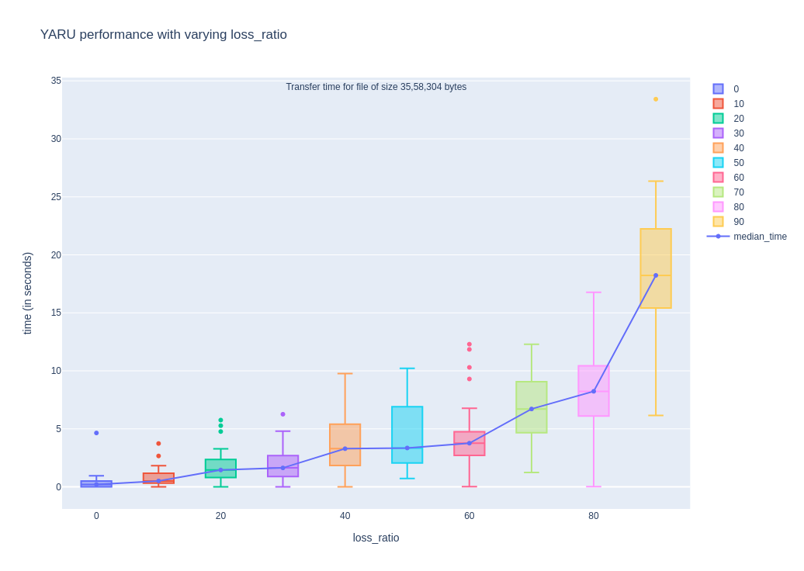
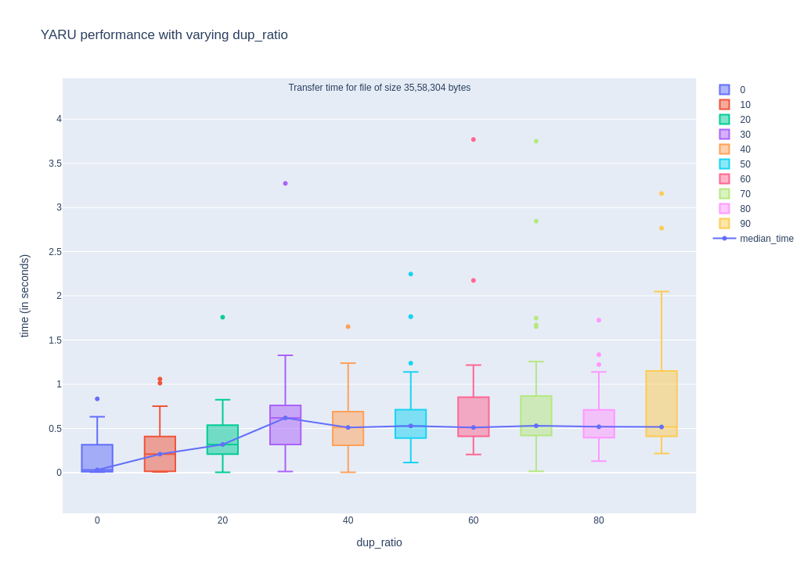
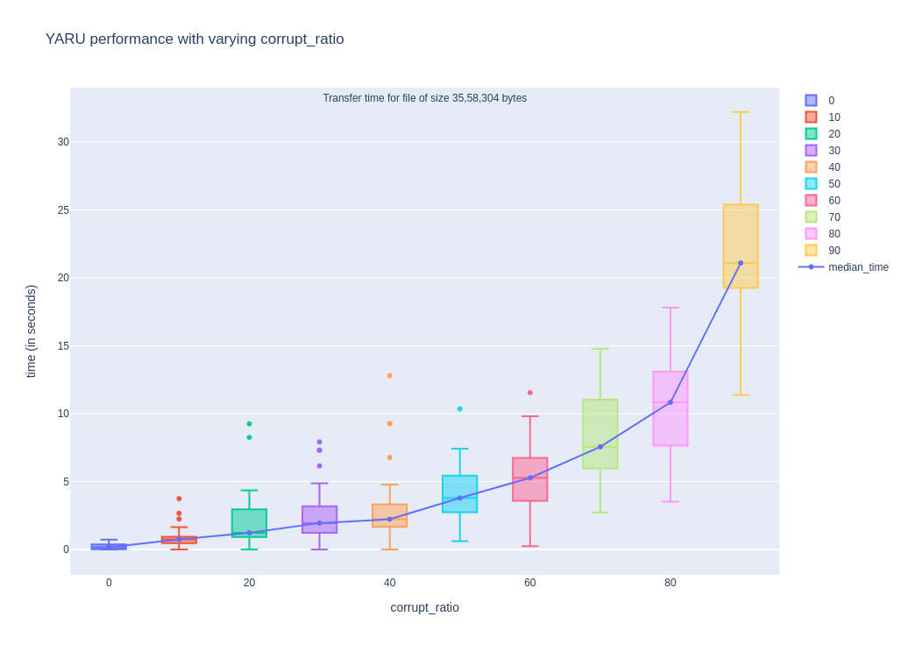

# Yet Another Reliable UDP (YARU)

## Introduction

YARU is an application layer transport protocol built on top of UDP to add properties of ARQ (Automatic Repeat reQuest). It is designed to be small and easy to implement, while still providing the minimum functionality to enable reliable transmission of data.

## Specification

See [`spec.md`](spec.md) for the specification of the protocol.

## Implementation

The implementation is done using Python 3, using only the standard library modules for ease of portability. 

* See [`YARU.py`](YARU.py) for the implementation of a socket capable of handling this protocol.
* See [`examples`](examples) folder for details on how to use the `YARUSocket` class.

Additionally, a [Wireshark](https://wireshark.org/) plugin has also been created, which enables inspecting YARU packets natively inside Wireshark GUI.

## Running

You need at least Python 3.8 installed in your system to be able to run the code.

Each example is given in a Client/Server architecture, which can be selected using a command line argument. So, you will need two terminals to run the examples. Always run the server first.

Steps:
1. Copy [`YARU.py`](YARU.py) file into the [`examples`](examples) folder.
2. In a terminal, just enter `python3 <filename>.py server` or `python3 <filename>.py client` to run the example.

Optional: To enable wireshark integration, copy [`wireshark_plugin.lua`](wireshark_plugin.lua) to its Lua Plugins Directory (Wireshark > Help > About Wireshark > Folders)

## Testing

### File Transfer
[`file_transfer.py`](examples/file_transfer.py) contains a very naive file transfer application code that uses the `YARUSocket` class to communicate over UDP and to demonstrate the reliability features of the protocol.

It's execution can be cutomized via command line parameters like:
* `address`: What interface to bind/connect to (default: localhost)
* `port`: Port of the receiver (default: 1060)
* `file`: (*required*) Which file to send
* `directory`: Where to store the received file (default: `Received`)
* `loglevel`: To set the cutoff for the logs to be displayed (default: DEBUG)

Pass either `receiver` or `sender` as role (`python file_transfer.py <role> <other arguments>`).  
`address`, `port` and `loglevel` should be specified before the role.

### Automated testing

[`tests/transfer_test.py`](tests/transfer_test.py) is a script to automatically run `file_transfer.py` in various network conditions, using [`netem`](https://wiki.linuxfoundation.org/networking/netem).

It runs the file transfer using YARU and stores the transfer time in JSON files under the [`results`](tests/results) directory.

[`tests/plot.py`](tests/plot.py) uses [plot.ly](https://plot.ly) to generate interactive Box Plots from the results.

## Charts

[Interactive chart](https://plotly.com/~userisro/129/)

")
[Interactive chart](https://plotly.com/~userisro/133/)

")
[Interactive chart](https://plotly.com/~userisro/135/)

[Interactive chart](https://plotly.com/~userisro/137/)

[Interactive chart](https://plotly.com/~userisro/139/)

## Author

[Krut Patel](https://github.com/iamkroot)
